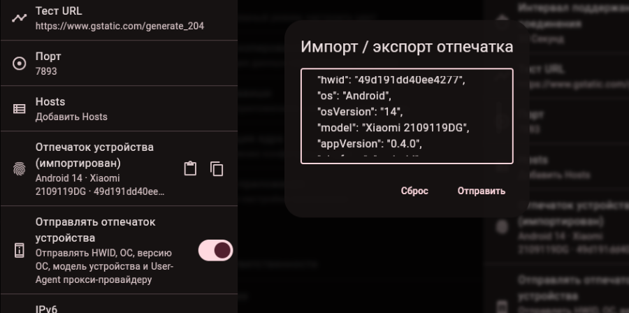

[🇷🇺](./README.md) | 🇺🇸

# FlClashY

FlClashY is a fork of [FlClashX](https://github.com/pluralplay/FlClashX), built with Flutter and Mihomo. Its main idea is to spoof the HWID and User-Agent, allowing you to use an unlimited number of devices under a single VPN subscription. Pay for one slot, use it everywhere.

## What's Added in This Fork

A portable device fingerprint that can be shared between Android and Desktop, including HWID, device model, OS version, and User-Agent for Remnawave.

